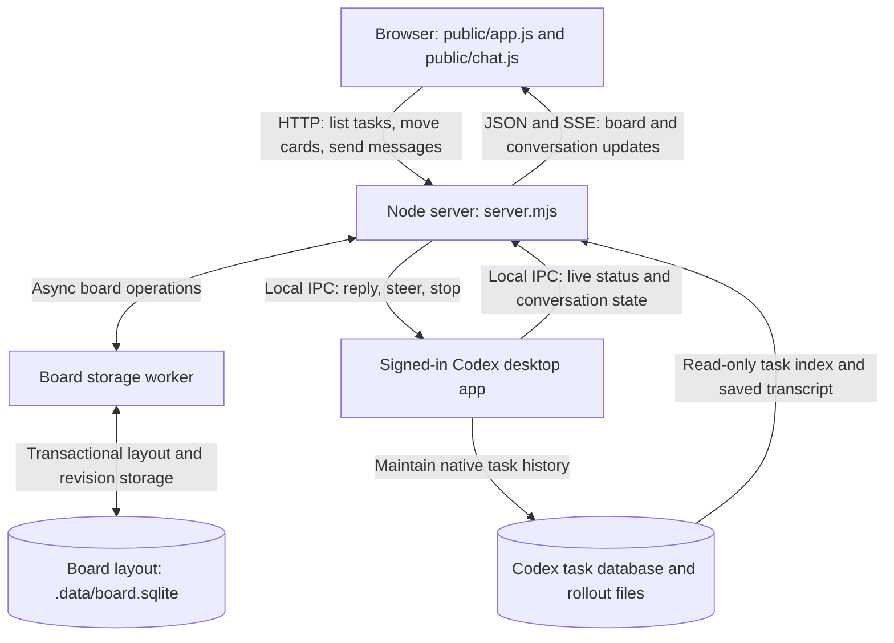
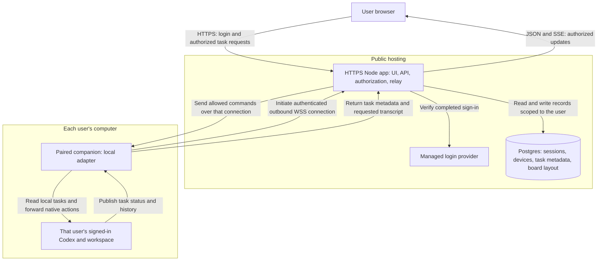
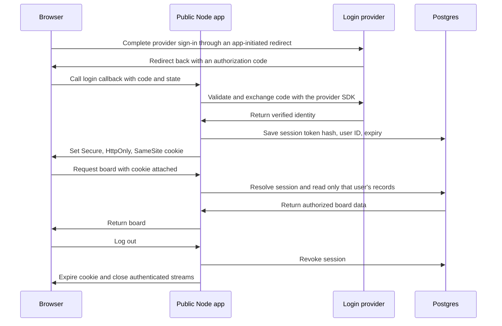

# Architecture and session state

| Field | Scope |
| --- | --- |
| Purpose | Explain where this repo keeps state and how it could serve multiple users over the internet. |
| Audience | A developer familiar with browser requests and a backend server. |
| Prerequisites | Basic HTTP, files, and database concepts. |
| Non-goals | Implementing authentication, selecting paid services, or deploying a public service. |
| Source | Repository source and linked official documentation, read on 2026-09-13. |

Today, this is a browser UI attached to one person's local Codex installation.
For a public version that preserves existing desktop tasks, the proposed design adds website login, shared database storage, and a companion connection to each user's computer.
The public design below is a proposal; the repo currently implements only the local system.

## Current local system

The browser, server, files, and desktop app below all run on the same computer.

Legend: rectangles are software components, cylinders are persistent stores, and solid arrows name data or actions flowing in one direction.

| Component | Responsibility | Source |
| --- | --- | --- |
| Browser | Draw the board, hold drafts, and render normalized conversation items. | [app.js](public/app.js), [chat.js](public/chat.js) |
| Node server | Serve the UI, check local requests, and route task actions. | [server.mjs](server.mjs) |
| Board layout | An asynchronous facade sends operations to a worker-owned SQLite database. | [board.mjs](lib/board.mjs), [board-worker.mjs](lib/board-worker.mjs) |
| Codex files | Supply saved task metadata and conversation history. | [tasks.mjs](lib/tasks.mjs), [transcript.mjs](lib/transcript.mjs) |
| Codex desktop | Own task execution, account login, approvals, and native live state. | [desktop.mjs](lib/desktop.mjs), [conversations.mjs](lib/conversations.mjs) |

Kanban owns the presentation and manual organization; Codex remains the source of truth for native tasks.

### Where state lives now

| State | Location | Lifetime |
| --- | --- | --- |
| Task titles, workspace paths, project assignments | `CODEX_HOME/state_5.sqlite` and `.codex-global-state.json` | Saved by Codex; Kanban reads them. |
| Saved conversation history | Rollout files referenced by Codex's database | Survives a Kanban restart. |
| Manual lane, card order, and layout revisions | `.data/board.sqlite` | Persist transactionally across restart; resets retain card revisions. |
| Unsent draft and pending submission | Browser `sessionStorage`, keyed by task ID | Survives reloads in the same tab; no cross-device sync. |
| Search, selected project, open panel | Browser JavaScript memory | Rebuilt or reset when the page reloads. |
| Live snapshots, connections, transcript caches | Node process memory | Rebuilt from Codex after reconnecting. |
| Submission deduplication and action locks | `Conversations.submissions` and `locks` in memory | Lost on server restart. |
| Local request token | Generated in `createApp()` and included in `/api/board` | Changes when that server instance restarts. |
| Website user/login session | No implementation | All clients reach the same local account and board. |
| Codex login credentials | Managed by Codex outside this repo | Governed by Codex's credential storage and sign-in lifecycle. |

These stores are visible in the source files linked above; no private credential file was opened for this explanation.
Codex documents credential caching in an OS credential store or `auth.json`, depending on configuration.
Kanban does not read or copy those credentials. [Codex authentication](https://learn.chatgpt.com/docs/auth)

`BoardStore` uses a persistent worker and SQLite WAL with full synchronization and a one-second lock timeout.
Each move/reset checks `expectedLayoutRevision`, updates current lane order, and increments the card and board revisions within one transaction.
The HTTP interface returns `boardRevision` and per-task `layoutRevision`; a stale edit receives HTTP 409 without a write.
Browsers allow different cards to remain pending independently and discard older snapshots by revision and request sequence.
This supports multiple clients of one server, not multiple server processes or databases on network filesystems.
The legacy JSON is imported once and retained as a backup; see [backup and reset instructions](docs/usage.md#back-up-or-reset-local-board-state).
The server also retains recent submission IDs only in memory, so it cannot guarantee duplicate suppression across a restart.

### What the current token means

The local token is a request guard, not a user login.
`GET /api/board` returns task metadata and the token without an account authentication step.
Subsequent task routes require it in `x-kanban-token`.
The server combines this with loopback binding and local Host/Origin checks. [HTTP boundary](server.mjs)

Changing the bind address or adding a public tunnel does not create user isolation.
A proxy that lets visitors through to this local service would give them access to the same native tasks and message controls.
The macOS `open` action would also open Codex on the server machine, not on a remote visitor's computer.

## Proposed public client and server

The first public version can keep Codex execution on each user's computer while hosting the website and account data centrally.

Legend: groups show hosting boundaries, rectangles are services, cylinders are persistent data, and arrows label message direction.
Commands use the companion's existing outbound connection; the cloud does not open an inbound port on the user's computer.

| Component | Ownership in the proposal |
| --- | --- |
| Browser | Display state, a website session cookie, and optional local drafts. |
| Public Node app | Authenticate requests, enforce ownership, and route commands to the correct device. |
| Login provider | Verify the person's identity through a supported sign-in flow. |
| Postgres | Persist website sessions, device ownership, task metadata, and board layout. |
| Companion | Pair with one website account and allow only the supported local task operations. |
| Local Codex | Retain the user's credentials, source files, native conversations, and execution permissions. |

The cloud sees any metadata and conversation text relayed through it.
The proposed first version stores task metadata and board state centrally, while fetching transcript content on demand from the companion.
A disconnected computer therefore leaves a cached board with an explicit offline status; live history and actions are unavailable until it reconnects.
Approvals still require Codex on that computer unless a separate approval UI is deliberately implemented.

Device pairing needs a short-lived, single-use challenge confirmed by the signed-in user.
The resulting device credential is separate from the website cookie and can be revoked independently.
Each command is scoped to the paired device and an allowed task; the relay does not expose arbitrary filesystem paths or raw desktop IPC.

## Website login and durable state

A website session answers which user sent an HTTP request.
A Codex task identifies a conversation and its execution context.
Ending the website session does not delete the task or sign the user out of their local Codex account.

This proposed login flow keeps a session identifier in the browser and its authoritative record on the server.

Legend: each lifeline is a participant, and each arrow is a request or response in time order.
The server derives identity from the verified session, never from a client-supplied `userId`.

Use a maintained authentication/session library and provider SDK for callback validation, including OAuth state and PKCE where applicable.
For the proposed opaque-session design, the browser holds an unpredictable token in a host-only `Secure; HttpOnly; SameSite=Lax; Path=/` cookie.
Its server record stores a token hash, user ID, idle/absolute expiry, and revocation state.
Session rotation after sign-in, logout invalidation, and CSRF protection on mutations complete the lifecycle.
Persistent cookie expiry must match the intended login duration; a server restart alone should not sign people out. [OWASP session management](https://cheatsheetseries.owasp.org/cheatsheets/Session_Management_Cheat_Sheet.html)

The following is a proposed minimal data model, not a migration already present in this repo.

| Record | Important fields | Purpose |
| --- | --- | --- |
| User | `id`, `identity_provider`, `provider_subject` | Link a verified provider identity to an internal owner. |
| Web session | `token_hash`, `user_id`, `expires_at`, `last_seen_at`, `revoked_at` | Preserve login across requests and API restarts. |
| Device | `id`, `user_id`, `credential_hash`, `last_seen_at`, `revoked_at` | Route requests to an authorized companion. |
| Task | `id`, `user_id`, `device_id`, `native_thread_id`, display metadata | Identify the original native task within its owning device. |
| Board card | `user_id`, `task_id`, `column_override`, `position`, `version` | Persist manual placement and detect conflicting moves. |
| Command | `user_id`, `task_id`, `message_id`, payload hash, status, result | Track accepted, completed, failed, or uncertain delivery. |

Task identity is unique within a device, and command identity is unique within its owner/task scope.
Foreign keys and authorization checks must prevent records from referencing another user's device or task.
Every list, transcript read, SSE subscription, move, send, steer, stop, and device response checks ownership.
Long-lived streams also end when their session expires or is revoked.

A durable command record allows reconnecting clients to inspect delivery status.
It does not by itself make native execution exactly once: a companion can crash after Codex accepts a command but before the acknowledgment is saved.
The companion needs a durable receipt journal and reconciliation with native history; unresolved delivery stays marked uncertain instead of being resent automatically.
There is no offline command queue in the proposed first version.

Draft sync is optional.
Keeping drafts in `sessionStorage` preserves the current behavior; cross-device drafts would need an explicit database record and retention choice.
A public client must scope local drafts to its website user and clear private UI state on logout or account changes.

## Where Codex runs and what gets hosted

| Design | Execution and login state | Fit for this repo |
| --- | --- | --- |
| Public website plus local companion | Each user's computer retains Codex login, repositories, and native task history. | Recommended first version when the goal is existing desktop tasks. Requires an online companion. |
| Fully hosted runner | Each tenant gets an isolated runtime, workspace storage, and runtime credentials. | Appropriate when users need execution while their computers are off. Requires a new execution backend. |

The companion design preserves this repo's defining behavior: messages continue the original desktop task.
Its existing database schema and desktop IPC are private interfaces, so the adapter remains sensitive to Codex updates. [Integration limitations](docs/compatibility.md)

A hosted runner should sit behind the authenticated API, with isolated filesystem access, resource limits, and private runtime transport.
It needs durable workspace/history storage and recovery rules for interrupted runs; the web application's session database cannot restore an in-flight process.
It also needs an explicit credential and billing model, such as service-funded API access or user-provided credentials.
One shared signed-in desktop account is not a per-user execution design.

The documented Codex App Server offers thread/turn operations, account login methods, and a default stdio transport for an application-controlled runtime.
It is a candidate for a new runner backend, not a verified replacement for this repo's connection to already-running desktop tasks.
Its TCP WebSocket transport is currently documented as experimental and unsupported. [Codex App Server](https://learn.chatgpt.com/docs/app-server)

Login to this website would still be separate from the runner's OpenAI authentication.
Codex documents ChatGPT sign-in and API-key sign-in; account availability and billing must be checked for the chosen hosted product. [Codex authentication](https://learn.chatgpt.com/docs/auth)
If future tasks also need third-party service logins, those credentials need their own scoped storage and refresh lifecycle in the owning execution environment.
This repo currently provides no service-credential manager.

### Hosting proposal and repo changes

For the companion version, a managed Node service plus managed authentication and Postgres avoids operating those services yourself.
Render is one candidate for the Node app, and Supabase is one candidate for authentication and Postgres.
These are options for review, not selected or provisioned services. [Render web services](https://render.com/docs/web-services), [Supabase Auth](https://supabase.com/docs/guides/auth)

Supabase normally issues JWTs; the opaque cookie example above is an application-session layer, not its default browser SDK behavior.
If selected, its server integration would need to keep provider tokens server-side and define refresh and logout behavior explicitly.

| Repo surface | Change required before public use |
| --- | --- |
| `server.mjs` | Separate public API startup from local Codex initialization; add user sessions, ownership checks, device routing, configured HTTPS origin handling, and stream revocation. |
| `lib/board.mjs` | Replace the public service's JSON store with transactional database records scoped to the user. |
| `lib/tasks.mjs`, `lib/desktop.mjs`, `lib/transcript.mjs` | Keep local filesystem and IPC access in the companion. |
| `lib/conversations.mjs` | Preserve original-task routing locally; add durable delivery tracking at the cloud/companion boundary. |
| `public/app.js`, `public/chat.js` | Add sign-in/out, device status, user-scoped drafts, and authenticated API access. |

The public Node process can serve the existing static UI and API under one HTTPS origin.
It needs hosting that supports the chosen SSE and companion WebSocket connection lifetimes, with reconnect behavior tested through the real proxy.
Deployment configuration would include the public origin, provider callback settings, database credentials, and a health endpoint.
The server's current loopback binding and local Host checks need deliberate replacement at the public boundary; changing those settings alone is insufficient.

The smallest public release boundary is sign-in, device pairing, and a read-only board scoped to the user.
Message controls follow once cross-user rejection, session revocation, and uncertain-delivery recovery are verified.
The product decision before implementation is whether the first release requires local desktop continuity or execution while the user's computer is off.
