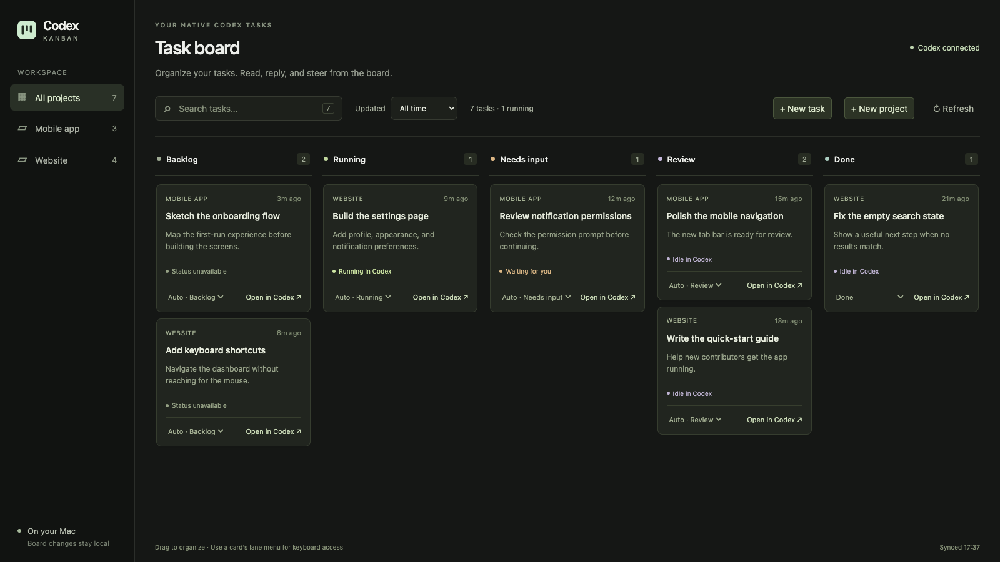
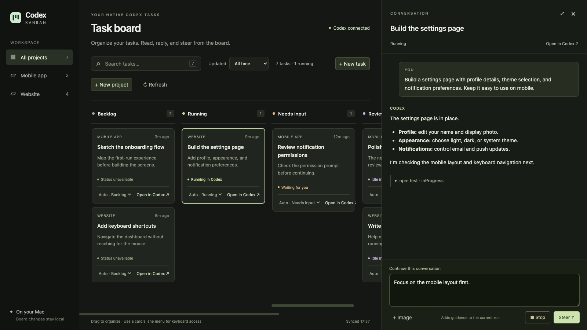
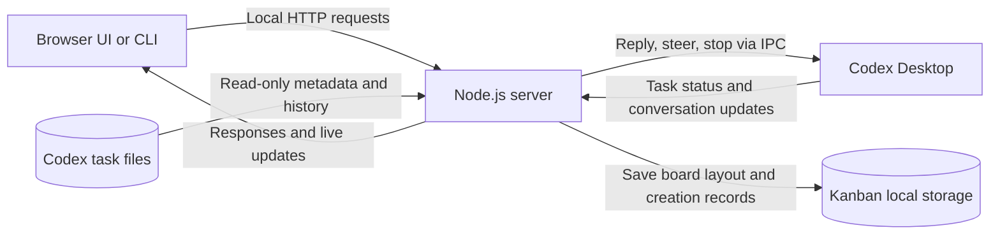

# Codex Kanban

A local board for your Codex Desktop tasks: see what’s running, what needs you, and what’s ready to review.
Unofficial macOS alpha. No separate API key needed.

## Features

- Drag cards between lanes, reorder them, and filter by project, search, or last update.
- Follow live task status as running tasks, approval requests, and idle tasks update their lanes automatically.
- Read conversations, attach images, send replies, steer active runs, or stop them from the side panel.
- Create local projects and tasks from the board or optional CLI.



Click a card to open its conversation beside the board.
Use **Open in Codex** for approvals, native tools, and file review.
Your tasks keep their native history and workspace.



*Screenshots show sample projects and conversations in the app’s actual interface.*

See [board usage](docs/usage.md) and the [CLI reference](docs/cli.md) for details.

## Installation

Requires macOS, Node.js 24 or newer, and Codex Desktop installed and signed in.
Native features use local tasks; worktrees and cloud tasks are not supported.

```sh
git clone https://github.com/tedzhao226/codex-kanban.git
cd codex-kanban
npm ci
npm start
```

Open [the board](http://127.0.0.1:4317) and keep the server terminal running.

Task creation uses `/Applications/ChatGPT.app/Contents/Resources/codex` by default.
If your installation is named `Codex.app`, run:

```sh
KANBAN_CODEX_BIN=/Applications/Codex.app/Contents/Resources/codex npm start
```

For other installations, set `KANBAN_CODEX_BIN` to the actual bundled executable.
Use `PORT=4318 npm start` to change the port, or set `CODEX_HOME` if your Codex data lives elsewhere.

For the optional CLI, run `npm link` once, then use it with the same running server:

```sh
codex-kanban --help
codex-kanban project list
codex-kanban task list --json
```

Without linking, use `npm run cli -- --help`.
See [compatibility and support](docs/compatibility.md) for tested versions and limitations, or [contributing](CONTRIBUTING.md) for development and checks.

## Architecture

Everything runs on the same Mac.
The plain JavaScript browser UI and CLI share one Node.js server.



The server reads saved Codex tasks and connects to Desktop through local IPC for live conversations and task controls.
Codex Desktop owns execution, credentials, and approvals.
Creating a task briefly starts Codex’s bundled App Server to save an empty task, then hands it to Desktop for execution.

Kanban stores board layout in SQLite and task-creation records under the Git-ignored `.data/` folder.
Browser drafts stay in tab session storage.
See [local data and backups](docs/usage.md#local-data) before resetting or restoring state.

The server listens only on `127.0.0.1` and uses a per-process request token.
It has no user login or multi-user isolation; keep it local and do not expose it through a tunnel, proxy, or LAN bind.
The integration relies on private Codex interfaces and may need updates when Desktop changes.

See [architecture and session state](ARCHITECTURE.md#current-local-system) for module boundaries and [security](SECURITY.md) for reporting vulnerabilities.
Hosted designs in the architecture docs are proposals; this release is local-only.

The source is publicly available, but no open-source license has been granted yet.
