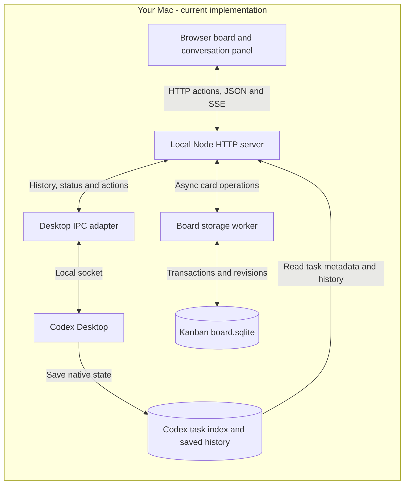
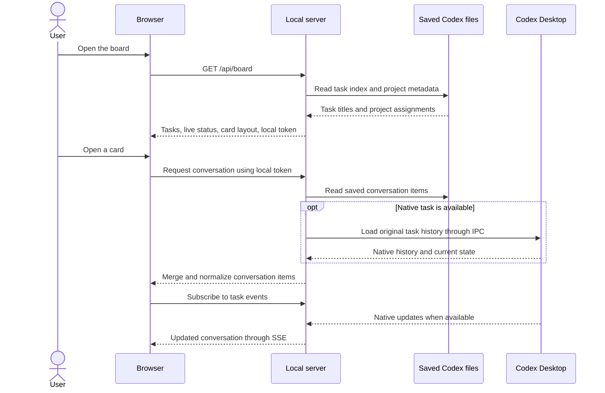
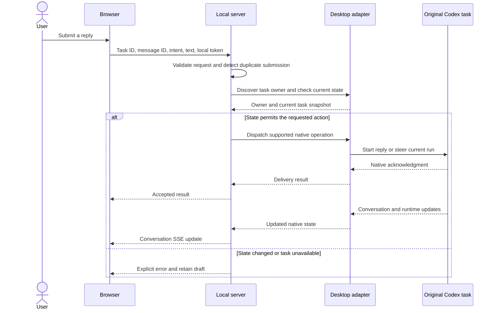
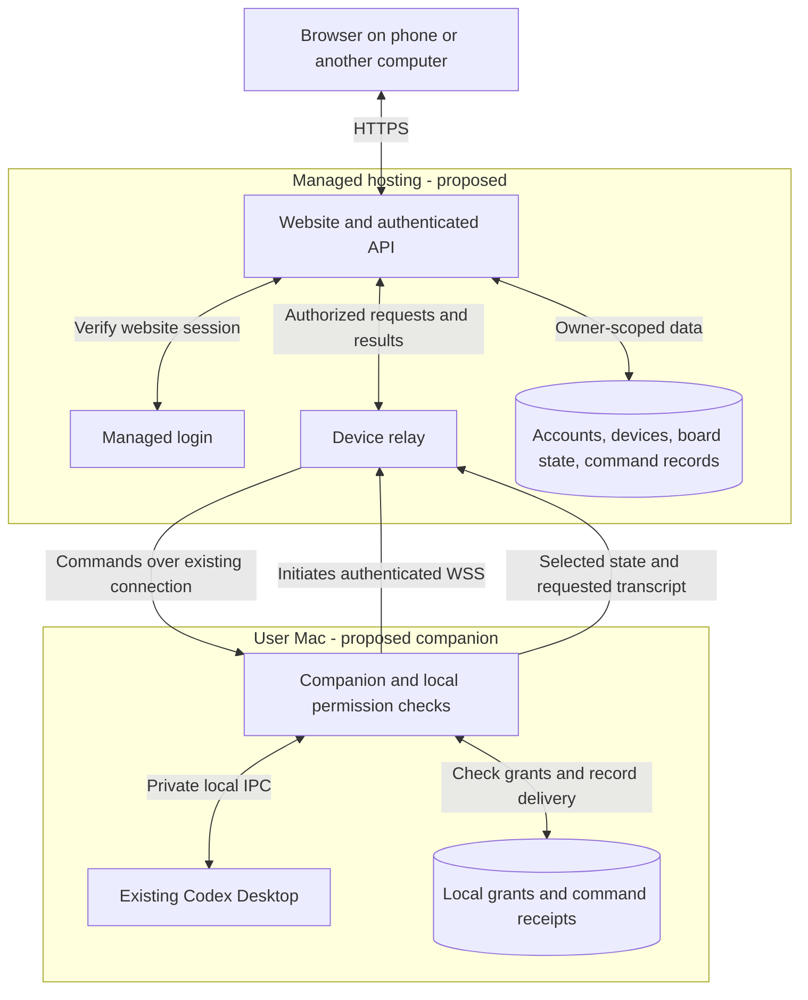

# Kanban architecture and data flow

| Field | Value |
| --- | --- |
| Purpose | Explain how the board reaches existing Codex tasks and how a future remote website would connect. |
| Status | The local architecture exists; the hosted architecture is a proposal. |
| Reviewed | 2026-09-13, against selected source files in the current working tree. |

## The core idea

The Kanban board is another interface to your existing Codex Desktop tasks.
Codex owns the conversation, workspace, execution, and native permissions.
Kanban owns card arrangement and its own conversation display.

Today, the browser and Kanban server both run on your Mac.
Opening the board in a browser does not mean it is hosted on the internet.
The server listens at `http://127.0.0.1:4317` and uses local files and a local socket to reach Codex.

## 1. What runs today

Rectangles represent software; cylinders represent stored data.
IPC means communication between programs on the same computer.
SSE means a server-to-browser stream used to update an open conversation.

There are two sources of Codex information.
Saved files provide task metadata and previous messages, including when a task is not loaded in the desktop app.
The live IPC connection provides current execution state and routes commands to the original task owner.
Kanban combines these into the browser's display.
It does not write directly into Codex's task database or create a replacement execution session.

| Module | Main responsibility | Source |
| --- | --- | --- |
| Browser | Draw cards, display sanitized conversation content, keep drafts, submit explicit actions. | [app.js](../public/app.js), [chat.js](../public/chat.js) |
| HTTP server | Serve the local page, enforce local request checks, and route reads/actions. | [server.mjs](../server.mjs) |
| Task index | Read task and project metadata from Codex's files. | [tasks.mjs](../lib/tasks.mjs) |
| Conversation module | Merge saved/live messages, expose available controls, and track submissions. | [conversations.mjs](../lib/conversations.mjs), [transcript.mjs](../lib/transcript.mjs) |
| Desktop adapter | Handle private protocol versions, owner discovery, native requests, and live updates. | [desktop.mjs](../lib/desktop.mjs) |
| Board storage | A worker owns transactional SQLite storage for card layout and revisions. | [board.mjs](../lib/board.mjs), [board-worker.mjs](../lib/board-worker.mjs) |

## 2. Opening a card and reading its conversation

The browser receives display-oriented messages and tool summaries, rather than raw native snapshots.
The saved transcript reader omits internal reasoning and injected instructions.
These filters are not a guarantee that messages or tool output contain no sensitive information.

If the native task is unavailable, saved history can still be readable while execution controls remain disabled.
**Open in Codex** or **Connect in Codex** uses a native deep link to open that original task.

## 3. Sending a reply

Acceptance means Codex accepted the request; it does not mean the resulting work has finished.
Approvals and structured questions are still handled in Codex Desktop.
New replies inherit the original task's native settings, including its execution permissions.

The current adapter checks the expected run before steering, but does not send that precondition in the native steer payload.
There is still a race if the run changes during delivery.
A remote release must prove atomic run targeting or leave steering unavailable.
If delivery cannot be confirmed, preserve an uncertain state and do not automatically resend.

Moving a card follows a simpler path: browser action, local validation, then a SQLite transaction in the board worker.
The request includes the card revision the user observed.
The worker rejects a stale revision with HTTP 409, or commits the new placement and increments the card and board revisions together.
Different-card edits use the latest committed ordering, so they do not replace one another's changes.
Database lock waits stay off the HTTP thread, allowing conversation streams to continue.
Moving a card to Done does not stop Codex or change its native conversation.

## 4. Where data lives

| Data | Current location | Owner |
| --- | --- | --- |
| Task index | `CODEX_HOME/state_5.sqlite` | Codex; Kanban opens it read-only. |
| Project metadata | `CODEX_HOME/.codex-global-state.json` | Codex; Kanban reads it. |
| Saved conversation | Rollout files referenced by Codex's database | Codex. |
| Manual card layout and revisions | Repository-local `.data/board.sqlite` | Kanban's storage worker. |
| Unsent drafts | Browser tab `sessionStorage` | Kanban browser UI. |
| Live snapshots and recent submission IDs | Local Node process memory | Kanban; rebuilt or lost on restart. |
| OpenAI login credentials | Codex-managed local credential storage | Codex; Kanban does not copy them. |

`CODEX_HOME` normally points to `~/.codex`.
There is currently no website-account database or per-user website session.
The local process token is a request guard, not a login or a separation mechanism for multiple users.
One local server supports concurrent browser/API clients, with per-card pending state and revision conflicts.
The previous JSON is imported only once; see [backup/reset guidance](../README.md#board-backup-and-reset) before copying, deleting, or restoring SQLite files.

## 5. Proposed remote architecture

This diagram is a future design, not the current deployment.

The companion is the local part of Kanban, packaged to connect to the hosted service.
It reuses the native adapter and file readers, while adding pairing, local permission checks, and durable command receipts.
The local app can remain usable independently.

The Mac initiates an encrypted outbound connection to the relay.
Commands return over that connection, so the cloud does not need an inbound port into the Mac.
WSS is WebSocket over TLS; it provides an encrypted connection, while the application must still check who may use it.
GitHub Pages could host static project material, but a running backend is needed for login, authorization, and relay behavior. [GitHub Pages](https://docs.github.com/en/pages/getting-started-with-github-pages/what-is-github-pages)

For each remote action, the hosted app checks the website session and ownership of the device/task.
The companion separately checks its locally approved account, task scope, action, grant lifetime, and execution policy before dispatch.
Account login does not grant control of every paired task automatically.
The backend cannot enlarge local grants.

Codex credentials and source trees remain on the Mac.
Selected metadata reaches the cloud, and allowed transcripts are fetched on demand.
Under the proposed trusted-relay model, relayed text is visible to the service operator; TLS does not make it end-to-end encrypted.
If the Mac is offline, show cached metadata as stale and disable live reads and actions.
Do not queue prompts for automatic execution when the Mac wakes.

## 6. What must be added before remote release

| Already present | Required addition |
| --- | --- |
| Local browser and HTTP server | Hosted website sessions and account-scoped data. |
| Private Desktop adapter | Paired outbound companion channel and tested compatibility gate. |
| Local token and origin checks | User/device/task authorization plus independent local grants. |
| Native inherited permissions | A verified runtime policy suitable for remote execution. |
| In-memory submission tracking | Durable receipts, expiry, revocation, and crash reconciliation. |
| Local content rendering | Remote content/privacy limits and hostile-content tests. |

A task allowlist restricts which conversation receives a prompt; it does not restrict everything that task's tools can do.
The runtime must enforce filesystem, network, and connected-tool limits below the model.
If the native integration cannot guarantee the required policy, keep remote execution disabled.

The Desktop database and IPC are private implementation details.
The documented App Server is another integration surface, but is not verified here as a replacement for controlling existing Desktop tasks. [OpenAI App Server documentation](https://learn.chatgpt.com/docs/app-server)

For release stages, security gates, privacy choices, and effort estimates, see the [public-release security plan](plans/public-release-security.md).
The earlier [architecture and session-state notes](../ARCHITECTURE.md) contain more detail on a proposed hosted session database.

Verification: all four diagrams parsed and rendered in Ego Browser and were visually inspected.
Local Markdown links and fence structure were checked.
This document describes selected source behavior; it does not certify the implementation's security.

---

Recommended docu.md theme: Technical.
Open this file in docu.md and press Cmd+S to export DOCX.
