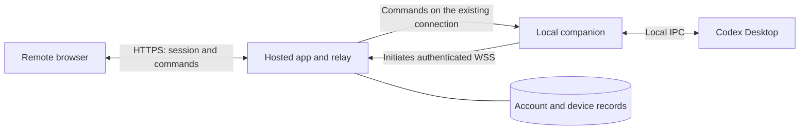

# Public release and remote-control security plan

| Field | Value |
| --- | --- |
| Status | Proposal for discussion; no deployment or application changes authorized by this document. |
| Date | 2026-09-13 |
| Audience | Ted, future contributors, and a security reviewer. |
| Goal | Release the local app as open source, then evaluate a hosted website that controls each user's own Codex Desktop tasks. |
| Planning scope | macOS first; individual accounts; one paired Mac per account; managed infrastructure. |

## Recommendation

Start with a local open-source alpha, then an invitation-only hosted beta.
Keep the existing product distinction: organize and continue the original Codex Desktop tasks.
Use the first release to learn whether people value that distinction and whether the private Desktop integration is maintainable.
Treat remote execution as a separate release gate.

The earlier task **0913｜FEA｜Codex Kanban** discussed personal remote access through GitHub Pages and Cloudflare.
That discussion concerned one person's Mac; serving unrelated users requires account separation, device pairing, and ongoing security operations.
The existing [architecture proposal](../../ARCHITECTURE.md) describes a hosted website and companion.
This plan adds the release sequence, security requirements, and maintenance commitment.
These remain recommendations, not settled provider, license, or privacy decisions.

Suggested initial pilot: five to ten developers using the local app, followed by a small remote beta after its security gates pass.
Defer team sharing, hosted execution, remote approval handling, arbitrary file browsing, and offline command queues.
The Mac and Codex must remain available for remote actions; sleep and disconnection are explicit offline states.

## Evidence from the current repository

Storage implementation update: local card layout now uses worker-owned SQLite, transactional per-card revisions, and conflict handling for multiple clients of one server.
The JSON layout is imported once and archived as a backup.
This does not add durable native-command receipts; conversation submission tracking remains in memory.

This assessment inspected selected source files on a working tree with concurrent feature changes.
It is not a penetration test or a full security audit.

| Area | Observed behavior | Public-release implication |
| --- | --- | --- |
| Local request guard | `server.mjs` binds to loopback, checks Host/Origin, and issues a random process token. `/api/board` returns that token and local task metadata without user login. | Useful local protections; do not expose this HTTP server as a public account system. |
| Rendering | Local dependencies, CSP, Markdown sanitization, and bounded SVG reads are present. | Retain these protections and test hostile model/tool output as remote content. |
| Native integration | `lib/tasks.mjs` reads Codex SQLite in read-only mode; `lib/desktop.mjs` targets private IPC versions. | Publish a tested compatibility matrix and disable unsupported controls. |
| Execution authority | `lib/conversations.mjs` starts turns with `inheritThreadSettings: true`. | Existing settings may grant broad filesystem, network, or connected-tool access. |
| Delivery | Submission IDs and locks live in memory. | Restart-safe receipts and uncertain-delivery handling are required for a relay. |
| Steering | The expected run is checked locally, but the native steer payload does not include `expectedTurnId`; a changed result can produce a warning after acceptance. | Prove atomic run targeting or omit remote steering initially. |
| Distribution | The package is private; no license, security policy, or GitHub workflow was found in the inspected tree. | Prepare an intentional release package, contribution rules, and CI before publishing. |

Source locations at inspection: [HTTP server](../../server.mjs), [action routing](../../lib/conversations.mjs), [Desktop adapter](../../lib/desktop.mjs), [asset reader](../../lib/assets.mjs), and [package metadata](../../package.json).
No Codex credential files were inspected.

The documented App Server offers application integration, but its WebSocket transport is still marked experimental and unsupported.
Documentation does not establish it as a drop-in controller for this app's already-running Desktop tasks.
Verify that distinction before changing the execution backend. [OpenAI App Server documentation](https://learn.chatgpt.com/docs/app-server)

## Proposed connection

The companion opens the connection from the Mac.
The user does not open a router port, publish the IPC socket, or give the cloud a shell interface.
The browser addresses the hosted app, which routes commands through the existing connection.
Use HTTPS/WSS with certificate validation; do not invent a cryptographic transport.
Authentication, origin validation, action authorization, expiry, and resource limits must also cover long-lived connections. [OWASP WebSocket security](https://cheatsheetseries.owasp.org/cheatsheets/WebSocket_Security_Cheat_Sheet.html)

Prefer one managed deployment for the authenticated website and API, a managed identity provider, and a managed database.
Keep the browser and API on the same origin to simplify sessions and CSRF protection.
Select a platform only after testing its long-lived connection limits, restart behavior, costs, and log controls.
GitHub Pages can serve project documentation or static UI, but does not run the relay backend. [GitHub Pages documentation](https://docs.github.com/en/pages/getting-started-with-github-pages/what-is-github-pages)

### Trust and privacy decision

The lower-effort beta proposal trusts the hosted backend with relayed prompts and responses.
TLS protects network traffic, but the relay can read its plaintext and can issue commands within any local grant if compromised.
Device authentication alone does not prove that an individual command came from the intended human.
Say this clearly in onboarding and the privacy description.

Codex account credentials remain under Codex's local management; the companion never uploads its credential files or IPC socket.
Keep source trees and absolute workspace paths local, and upload only the selected board metadata needed for remote use.
Fetch explicitly permitted transcripts on demand, without cloud persistence by default.
Transcript text and even task titles may themselves contain secrets, so this is not a guarantee that no secret reaches the relay.
Exclude message bodies, tokens, and credentials from logs, crash reports, and analytics; keep third-party scripts out of the authenticated control page.
Limit operator access and document retention for board metadata, audit records, and backups.

End-to-end encryption with independently paired browser/device keys is a separate architecture choice if the product must hide content from the relay or resist forged relay commands.
It also needs replay protection, multi-browser enrollment, key recovery, and revocation.
Encryption alone is insufficient: malicious JavaScript served by a compromised website can use the browser's keys or capture plaintext.
A stronger claim requires an independently trusted client distribution/update path and specialist review.
Do not promise protection from a compromised cloud with a thin browser client and TLS alone.

## Pairing, permissions, and command contracts

### Pairing and session lifecycle

1. The user installs the companion and chooses projects locally; discovery does not upload every task automatically.
2. The companion creates a device identity using a maintained credential mechanism and stores its secret in the OS credential store.
3. It requests a short-lived, single-use pairing challenge tied to that identity and the intended service.
4. The user signs into the website with managed authentication, preferably a passkey or MFA, and confirms the named device.
5. The companion shows the account and requested access locally; the user confirms before pairing completes.
6. The backend binds the device to that account atomically, issues a device-scoped credential, and enforces expiry, rotation, and revocation.

Rate-limit pairing attempts, reject reused challenges, and require fresh authentication for adding devices or changing security settings.
Keep website sessions and device credentials separate; never use the current localhost token or a shared deployment secret as either identity.
Use server-validated sessions in Secure, HttpOnly, host-only cookies and explicit CSRF protection for mutations.
No long-lived bearer credentials in URLs, browser localStorage, or logs.

Device revocation must close its active channel and reject new commands.
Logout or session revocation must also invalidate relevant streams and unexecuted commands.
Account recovery must suspend existing remote-control grants and require local re-pairing before write access returns.
Deleting a device or account must remove its cloud metadata according to a documented retention and backup-expiry policy.

### Local authority

The companion has the final check before native dispatch.
It stores account binding, selected projects/tasks, allowed actions, grant expiry, and a local pause control.
The cloud cannot expand those grants.
Default to viewing selected metadata; require a separate local grant to read transcripts or enable execution.
For beta, make execution grants time-limited and visibly active on the Mac.
Expire grants locally and clear execution enablement on companion restart or machine suspend; require fresh local enablement after wake rather than silently renewing it from the cloud.

Allowlisting a task only determines which conversation can receive a prompt.
It does not constrain what that conversation's tools can do.
Before enabling remote send/steer, demonstrate that the native runtime enforces the intended filesystem, network, approval, plugin, connector, and credential limits, including previously granted permissions.
Reject remote execution when those controls are unsafe, unknown, or change beyond the grant.
Keeping approvals in Codex does not force an approval for every action; some actions may already be permitted.
The runtime policy, rather than prompt wording or an agent instruction file, must enforce restrictions. [OpenAI approvals and security](https://learn.chatgpt.com/docs/agent-approvals-security)

If the private Desktop interface cannot expose and enforce that contract, keep the remote product read-only until the gap is resolved.
A separate restricted Codex runtime is a possible alternative, but changes the promise of controlling existing native tasks and requires an explicit product decision.
Local malware or compromise of the user's OS account is outside the protection this relay can provide.

### Public interface and delivery

Expose a small set of operations: list selected tasks, read permitted transcript pages, move cards, send a message, stop a specific run, and steer only when exact-run targeting is proven.
Exclude generic RPC forwarding, arbitrary command execution, caller-selected filesystem roots, and remote permission changes.
Keep private Codex protocol details behind the existing Desktop adapter.
Add one command gateway module that owns authorization, validation, native dispatch, and durable delivery state rather than spreading checks across feature handlers.

Derive the account from the authenticated session.
Resolve task ownership through the account and device; a valid-looking native task ID is not authorization.
Apply that relationship to list queries, transcript reads, subscriptions, commands, and companion responses. [OWASP authorization guidance](https://cheatsheetseries.owasp.org/cheatsheets/Authorization_Cheat_Sheet.html)

The command envelope includes a protocol version, unique command ID, device/task identity, action, bounded payload, payload digest, expiry, and local grant generation.
Run-specific commands also include the expected native run ID.
New-turn commands require a reviewed task-context revision and an idle-state precondition; an idle task alone does not prove its settings or context are unchanged.
Require the native owner to enforce relevant preconditions atomically, or withhold the operation when the contract cannot be guaranteed.
The gateway binds the envelope to the initiating session; the companion accepts only its authenticated channel and its own active local grant.
Persist a receipt before native dispatch, reject conflicting reuse of an ID, and check expiration and revocation immediately before execution.
Fence superseded connections so an old connection cannot execute after a reconnect.

Maintain durable command metadata in the backend and a durable receipt journal on the companion.
Store only the minimum payload data needed, with explicit deletion rules; keep transcripts out of the command journal.
A crash after Codex accepts an action but before acknowledgment creates an uncertain outcome.
Reconcile with authoritative native state where possible; otherwise display uncertainty and require a deliberate new user action.
Do not promise exactly-once execution or silently replay pending prompts after restart, reconnection, or Mac wake.
A failed or stale steer must not become a new turn.

Pausing remote access blocks new dispatch but does not undo accepted work.
Offer a separate, explicit interrupt attempt for an already-running task and report whether Codex confirmed it.
Treat stopping a process and reversing its external effects as different operations.

## Threats and release tests

These are proposed acceptance scenarios, not tests already run.
Implement them through the real gateway/companion interface with deterministic fixtures, then verify selected cases on isolated native tasks.

| Threat | Required behavior and evidence |
| --- | --- |
| Another account guesses a task/device ID | Two-account tests reject reads, writes, subscriptions, and forged device replies without leaking metadata. |
| Stolen web session or pairing link | Pairing needs local confirmation; expired/replayed challenges fail; recovery and revocation cut off pending work. |
| Malicious website or rendered transcript | Cross-origin HTTP/WS attempts fail; hostile Markdown, SVG, links, and tool output cannot execute script, load arbitrary local files, or cause background commands. |
| Compromised relay | Locally ungranted projects/actions remain inaccessible; limitations within an active grant are disclosed and exercised in the threat model. |
| Prompt uses unexpected tools | Native runtime demonstrably denies access outside the approved execution policy; unknown policy disables send/steer. |
| Duplicate or stale command | Retry, delayed packet, altered payload, restart, owner change, new run, and revoked grant cannot silently execute the wrong action. |
| Resource exhaustion | Bound connections, transcript pages, frame/body sizes, work concurrency, and outgoing buffers; reject or disconnect slow/excessive clients without unbounded memory growth. |
| Private protocol changes | Unsupported versions disable actions; compatibility fixtures and live canary checks precede support for a new version. |
| Compromised release pipeline | Untrusted PRs cannot obtain signing/deployment credentials; release provenance and update signatures are verified. |

The asset endpoint needs its own remote scope decision.
Workspace-contained SVG reading does not imply permission to upload every file in that workspace.
Keep remote local-file fetching disabled initially; later use explicitly authorized asset identifiers, bounded reads, safe rendering, and filesystem-race review.

## Keeping future implementation rules enforceable

Treat repository instructions as contributor guidance.
Enforcement comes from the runtime, tests, repository settings, and release permissions.

| Layer | Proposed change | Enforcement |
| --- | --- | --- |
| Security contract | Add a short `SECURITY.md`, threat model, and an invariant list linked from `AGENTS.md` and contributor docs. | Every security-sensitive change names the affected invariant and its evidence. |
| Architecture | Only the command gateway can reach native control operations; separate browser input from trusted internal records. | Dependency/import checks and interface tests reject a new bypass route. |
| Regression checks | Cover isolation, grants, protocol validation, revocation, XSS, replay, and crash recovery. | Required CI checks block merging on failures. |
| Dependency and secret hygiene | Lockfile installs, secret scans, dependency review, static analysis, and scheduled update triage. | Define release-blocking findings and document any bounded exception with owner and expiry. |
| Review | Require PRs, protected security ownership, review of the latest changes, and review for workflow/test changes too. | GitHub rulesets enforce required checks and approvals; tightly limit bypass rights. |
| Distribution | Choose a license; publish clean source, release notes, supported versions, artifact checksums/provenance, and signed companion builds when distributing binaries. | Release job only uses approved source and protected credentials; the installed updater verifies authenticity and rejects disallowed downgrades. |
| Operations | Private vulnerability reporting, device revocation, service disablement, backups/restore, minimal audit events, and incident communications. | Assign a real owner, exercise recovery, and retain a tested rollback path. |

Use a version-pinned subset of OWASP ASVS 5.0.0 as the web-security baseline, aiming for applicable Level 2 requirements plus the native-execution checks above.
Record exclusions and evidence; do not describe the product as certified. [OWASP ASVS](https://owasp.org/www-project-application-security-verification-standard/)
GitHub rulesets support required status checks and review controls, but owners can have bypass powers; configure those deliberately. [GitHub rulesets](https://docs.github.com/en/repositories/configuring-branches-and-merges-in-your-repository/managing-rulesets/available-rules-for-rulesets)

For a solo maintainer, an independent human reviewer is a real staffing constraint.
An AI review can find issues and prepare evidence, but should not be described as an independent security audit.
Use an external reviewer for authentication, pairing, command authorization, updater changes, and the public launch gate.
Do not grant agents production or signing secrets to make development more convenient.

## Effort and gates

These are planning estimates for one experienced full-stack engineer at roughly 40 focused hours per week, reusing the current UI and managed services.
The estimates assume no major native-protocol rewrite, no team permissions, and no end-to-end encryption.
They include implementation and relevant verification; specialist fees, provider charges, and reviewer scheduling are separate.

| Stage | Additional engineering effort | Exit condition |
| --- | --- | --- |
| Local open-source alpha | 2–3 weeks | Clean-machine setup works; license and disclosure policy chosen; package excludes personal data; local request/rendering tests pass; CI and compatibility policy are in place. |
| Remote vertical slice | 3–5 weeks | Two accounts/devices are isolated; pairing, restricted local grants, revocation, and one authenticated action work end to end on test tasks. |
| Invitation-only beta preparation | 3–5 weeks | Native policy and run-targeting gates pass; durable delivery, offline behavior, recovery, limits, and security regression checks pass; reviewer findings resolved. |
| Public launch preparation | 1–2 weeks plus external review scheduling | Independent assessment/remediation, distribution controls, incident rehearsal, retention/deletion, and support expectations are complete. |
| Total | 9–15 engineer-weeks, about 360–600 hours | Approximately 2–4 months full-time if gates pass; 9–15 months at ten hours per week. |

Treat the first three to five days inside the local-alpha budget as a feasibility checkpoint.
Prove native policy visibility/enforcement and safe run targeting before investing in a relay.
If either cannot be guaranteed, revise scope and estimate before building remote execution.

Budget roughly 25–35% of initial engineering time for security, reliability, and verification, already included above.
After a small beta, reserve an initial 4–8 hours per week for dependency updates, Codex compatibility, vulnerability triage, release work, and support.
That reserve is an estimate, not an incident-response ceiling; an upstream break or security incident can consume several days.
Re-estimate after the first month of actual use.

A managed platform reduces server maintenance but leaves application authorization, local execution policy, privacy, and incident ownership with the maintainer.
Obtain current provider and security-review quotes after the deployment and trust model are chosen.
If the available commitment is only a few hours a week, keep the product local or offer documented user-managed remote access instead of promising a maintained hosted service.

## Decisions before implementation

| Decision | Suggested starting point | Why it matters |
| --- | --- | --- |
| First release | Local open-source alpha, then a separate remote beta gate. | Learn demand and compatibility before operating remote control. |
| Hosting | Managed website/API, authentication, and database; provider not yet selected. | Prefer platform services over maintaining servers. |
| Cloud trust | Trusted relay only if its access is acceptable to the intended users. | A relay-resistant product needs different client/key management and a new estimate. |
| Execution | Preserve native tasks only when their effective permission policy is verifiable and acceptable. | Otherwise choose read-only remote access or reconsider the runtime. |
| Distribution and support | macOS first; documented supported Codex versions; explicit license choice. | Constrain packaging and compatibility work. |
| Ongoing ownership | Ted as maintainer plus an identified independent security reviewer. | Review and incident response need people, not just automation. |

## Verification of this planning work

Inspected the earlier Kanban task, existing architecture notes, selected current source, and the linked primary documentation.
✅ Reviewed: a separate agent cross-checked the proposed security design under the user's critical-logic review rule; its seven material observations are incorporated here.
This label applies to the planning cross-check, not to the security of the implementation.
Application tests and live attack simulations were not run for this planning-only change.
Both planning documents passed local-link and Markdown structure checks; all five Mermaid diagrams parsed and rendered in Ego Browser, with visual inspection.
No runtime hardening, provider configuration, publication, or deployment is claimed.
The live Markdown rule was unavailable during this dated research pass; a local backup supplied formatting guidance.

---

Recommended docu.md theme: Technical.
Open this file in docu.md and press Cmd+S to export DOCX.
